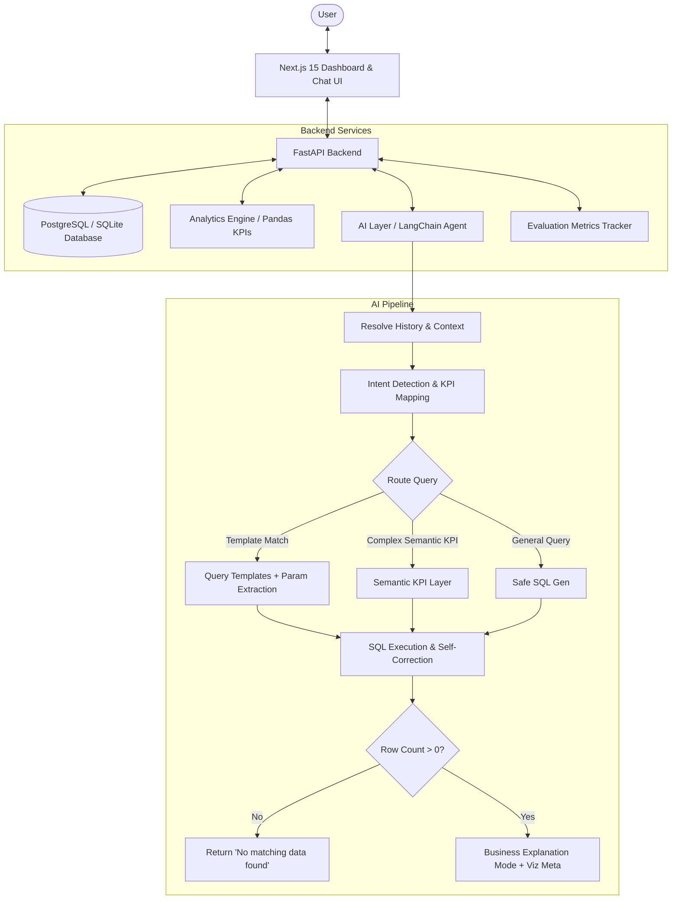
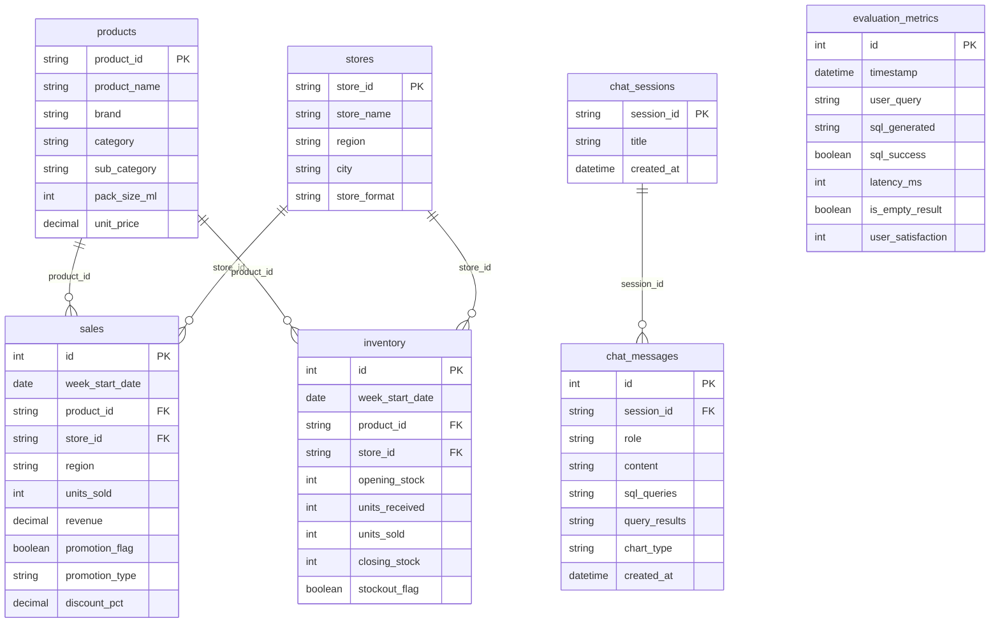

# FMCG Beverages Business Intelligence Assistant

🚀 **Live Demo on Hugging Face Spaces**: [Launch Assistant 🔗](https://huggingface.co/spaces/Mubeen09/fmcg-business-intelligence-assistant)

An AI-powered Business Intelligence (BI) Assistant and Executive Dashboard for the Beverages category in Fast-Moving Consumer Goods (FMCG). Business users can ask natural language questions and receive instant analytical summaries, structured tables, and dynamically rendered charts directly.

## System Architecture



### Database Schema (ERD)



## Key Features

1. **Executive Dashboard**: KPI cards and interactive charts summarizing revenue trends, regional performance, category sales share, and top-selling products.
2. **Conversational Analytics Chat**: Ask complex business questions like *"Which promotions produced the highest uplift?"* or *"Compare North and South sales"* and get answers with explanations.
3. **Semantic KPI Layer**: Intercepts natural language questions to map them directly to core business metrics (`promotion_uplift`, `discount_impact`, `inventory_turnover`, `stockout_rate`, etc.), improving reliability.
4. **Query SQL Templates**: Restricts SQL code generation to pre-parameterized templates for core analytical questions, preventing syntax errors and structural hallucinations.
5. **Chat Session Memory**: Multi-turn conversation logic that resolves context (e.g. following up *"Compare North and South sales"* with *"What about inventory?"* automatically queries inventory for North and South).
6. **Business Explanation Mode**: Generates analyst-like summaries that explain *why* changes occurred (e.g., attributing a sales peak to price cuts in the Juice category).
7. **Dynamic Visualizations**: The frontend detects backend chart-type metadata (`trend`, `comparison`, `distribution`, `table`) and automatically plots Recharts components (Line, Bar, Pie charts) inline.
8. **Hallucination Guardrail**: Intercepts queries returning zero database rows and outputs *"No matching data found."* to block the LLM from fabricating statistics.
9. **System Evaluation & Health Tracking**: Tracks SQL query success rates, latency (ms), empty-result rates, and user satisfaction feedback.
10. **Data Exporters**: Export query outputs to CSV and download structured corporate PDF reports (built with ReportLab).

---

## Directory Structure

```
├── backend/
│   ├── app/
│   │   ├── config.py          # Configuration & environment variables
│   │   ├── database.py        # Database session and connection pool
│   │   ├── models.py          # SQLAlchemy declarations (core tables + chat memory)
│   │   ├── data_generator.py  # Realistic 24-week synthetic data generator
│   │   ├── analytics.py       # Reusable Pandas KPI engine
│   │   ├── evaluation.py      # System diagnostic and success logging
│   │   ├── agent.py           # Text-to-SQL AI pipeline (Gemini / OpenAI / Mock fallback)
│   │   ├── report.py          # Corporate PDF generator (ReportLab)
│   │   ├── main.py            # FastAPI endpoints and startup logic
│   │   └── verify.py          # Automated verification script
│   ├── requirements.txt
│   ├── Dockerfile
│   └── .env.example
├── frontend/
│   ├── src/
│   │   ├── app/
│   │       ├── api.ts         # TypeScript API service layer
│   │       ├── page.tsx       # Main dashboard, chat, and metrics UI
│   │       ├── layout.tsx     # Next.js global layout
│   │       └── globals.css    # Tailwind CSS entrypoint
│   ├── package.json
│   ├── Dockerfile
│   └── tsconfig.json
├── docker-compose.yml
└── README.md
```

---

## Local Installation & Setup

### Prerequisites
- Python 3.12+
- Node.js v22+ and npm

### 1. Backend Setup
1. Open a terminal and navigate to `/backend`:
   ```bash
   cd backend
   ```
2. Create and activate a Python virtual environment:
   ```bash
   python -m venv venv
   # On Windows (PowerShell):
   venv\Scripts\Activate.ps1
   # On Linux/macOS:
   source venv/bin/activate
   ```
3. Install dependencies:
   ```bash
   pip install -r requirements.txt
   ```
4. Copy environment template and configure keys:
   ```bash
   copy .env.example .env
   # Or edit the newly created .env file and add your GEMINI_API_KEY or OPENAI_API_KEY
   ```
5. Seed the database and run the backend server:
   ```bash
   uvicorn app.main:app --host 0.0.0.0 --port 8000 --reload
   ```
   *Note: On startup, the database is seeded automatically with 19,200 records if empty.*

### 2. Frontend Setup
1. Open a new terminal and navigate to `/frontend`:
   ```bash
   cd frontend
   ```
2. Install dependencies:
   ```bash
   npm install
   ```
3. Launch the development server:
   ```bash
   npm run dev
   ```
4. Open [http://localhost:3000](http://localhost:3000) in your web browser.

---

## Running with Docker (Production Orchestration)

To launch the entire stack inside containers:
1. Ensure Docker Desktop is installed and running.
2. In the root directory, run:
   ```bash
   docker-compose up --build
   ```
3. The frontend will be accessible at `http://localhost:3000`, and the backend API will run at `http://localhost:8000`.

---

## Automated Testing & Verification

We have included a full test suite to verify database schemas, master counts, inventory formulas, and analytics algorithms.

To run the verification suite:
1. Ensure your backend virtual environment is active.
2. Navigate to the `/backend` directory.
3. Run:
   ```bash
   python -m app.verify
   ```
This script will:
- Clear and seed a fresh SQLite test database.
- Assert correct records (20 products, 40 stores, 19,200 weekly rows).
- Verify the inventory accounting equation `closing_stock == opening_stock + units_received - units_sold` holds true across all rows.
- Verify sales and inventory units are perfectly synced.
- Test Pandas KPI functions (Uplift, Turnover, Discount Impact).
- Test evaluation logger writes.
